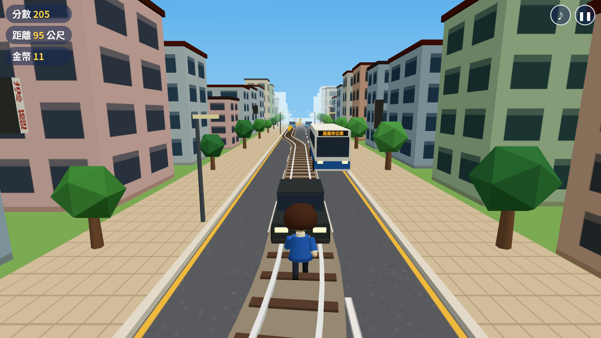

# 美惠快跑！（嘉義聯外軌道）mayor-run
純靜態網頁遊戲：王美惠沿著在三線道之間蜿蜒穿梭的聯外軌道奔跑，閃過汽車、機車、公車、卡車與計程車，收集金幣和雞肉飯（非官方趣味小遊戲）。
直接用瀏覽器開啟 index.html 即可（也可放到任何靜態主機，如 GitHub Pages）。
- index.html：入口與 UI
- game.js：打包後的遊戲（內含 Three.js r169，無外部 CDN）
- src/main.js：遊戲原始碼；vendor/three.module.min.js：Three.js 原檔
重新打包：npx esbuild src/main.js --bundle --format=iife --minify --outfile=game.js

操作：← → 換車道、↑／空白鍵 跳躍、↓ 滑行、P 暫停；手機左右滑換道、上滑／點擊跳、下滑滑行。
